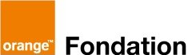
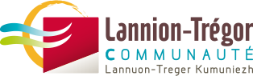
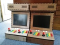

# Bilan moral

## Respect des statuts 1/2
* Fablab (référence MIT) : [AAAB](http://wiki.fablab.is/wiki/Fab_Lab_conformity_rating)
* ouverture à tous
* charte des fablab
* **découpeuse vinyl**
* participation à la communauté
* Réappropriation technique
* ateliers de réparation
* diffusion de matériel
Note: passage de AABB à AAAB

## Respect des statuts 2/2
* 3R : Réduire, Réutiliser, Recycler
* récupération en déchetterie
* Promotion du logiciel et matériel Libre
* utilisation quasi-exclusive de logiciels libres
* Libre en fête 2016
</section>

## Objectifs 2016 1/3
* Une découpeuse plasma &#9786;
* en cours ...
* Organisation de sessions enfants en partenariat avec la fondation Orange &#9786;
* 5 ateliers junior, ~50 enfants
* Etude sur le recrutement d'un permanent &#9786;
* service civique à 50%
* étude pour un mécénat de compétences

## Objectifs 2016 2/3
* Une proposition Fablab 2017 en ligne avec la maison des entreprises &#128528;
* discussions avancées avec LTC : Fablab 2018
* Leader dans l'organisation de libre en Fête 2016 &#128514;
* énorme succès !
* Trouver des débouchées pour le recyclage de PC &#9786;
* ventes en ligne avec nos capacités

## Objectifs 2016 3/3
* Formalisation fabmanager et cout d'utilisation des machines &#9786;
* gros travail de formalisation et documentation
* à poursuivre ...
* Rapprochement avec des associations artistiques/créatives? &#128528;
* Les artistes commencent à venir vers nous

## Association
* Emancipation du [co-working](http://www.coworking-lannion.org/)
* Renouvellement/expansion du public
* Création de [contenus pédagogique](http://wiki.fablab-lannion.org/index.php?title=Cat%C3%A9gorie:Formation)
* Support continu aux petits debrouillards
* Pouvoir adjudicateur (subvention Région/Europe)
* Nouveau [site web](http://www.fablab-lannion.org/) et ERP
* Adhésion de Orange et Nokia

## Projets / Machines
* Mise en place de référents machines
* Fabrication découpeuse [plasma](http://wiki.fablab-lannion.org//index.php?title=Plasma)
* Reprise de [Bzzz](http://wiki.fablab-lannion.org//index.php?title=Bzzz) et [Macareux](http://wiki.fablab-lannion.org/index.php?title=Comptage_Macareux)
* Bornes [d'arcade](http://wiki.fablab-lannion.org/index.php?title=Borne_d%27arcade)
* [Trender](http://wiki.fablab-lannion.org/index.php?title=Trender)
* [WakeUp](http://wiki.fablab-lannion.org/index.php?title=IR-WolAndShut) pour personnes à mobilité réduite
* Challenge Innovation (Dôme, Pommeau de douche)

## Reconditionnement 1/2
* [Collecte](http://wiki.fablab-lannion.org/index.php?title=R%C3%A9cup%C3%A9ration)
* 1 fois par semaine
* 1 fois tous les 15 jours depuis novembre (moins de matériel)
* standby du 15 juillet au 1er septembre
* PC portables difficiles
* 1500€ de pc vendus

## Reconditionnement 2/2

|     | Récup. | Réparation | Retour | À traiter |
| --- | --- | --- | --- | --- |
| Fixes | 101 | 24:24% | 38:38% | 39:39% |
| Portables | 25 | 0:0% | 7:28% | 18:72% |
| Écrans | 57 | 32:56% | 20:35% | 5:9% |
| Claviers | 19
| Souris | 14

## Quelques chiffres
* 75+10 Adhérents, en baisse, mais meilleure fidélisation
* ~ 200 Personnes enregistrées sur le forum
* 5 ateliers Junior, ~ 50 enfants
* 50 Heures de découpeuse Laser facturées
* 800 personnes à Libre en Fête

# Remarques ou questions ?
