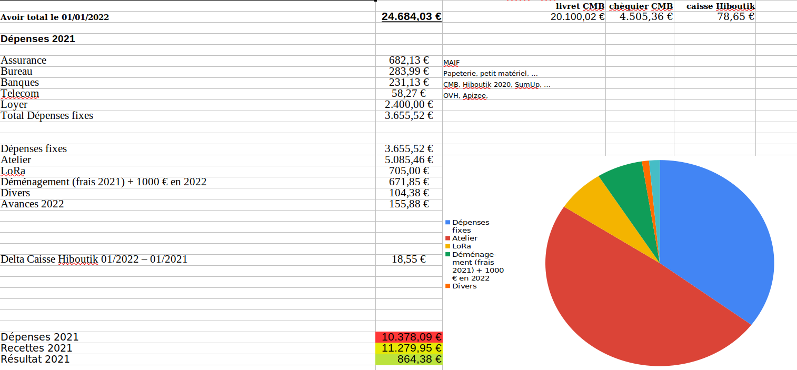

# Bilan financier

____

____

____

____
## Déclarations obligatoires

Déplacements: RAS malgré utilisation de nombreux véhicules et remorques pour déménager

Heures bénévolat : idem 2020, environ un ETP -> 50 000 €/an + déménagement par FabLab
évalué à 10 000€ +	Loyer équivalent: 5400€ + 3600€ (ex-cantine)

Bilan FabLab “réel” 2021 : CA 11000€ - 2400€ (loyer 2021) + 50 000€ + 10 000€ + 9 000€
Total = environ 80 000€

Déclaration accident : un sinistre lors du déménagement (1600€) pris en charge par MAIF (en cours)
____
## Bilan

__2eme Année Covid : ventes encore en baisse, 4200€ contre 5800€ en 2020__

Investissements malgré tout en hausse : 3000€ sur la brodeuse numérique, 700€ sur LoRa

Impact faible du déménagement grâce à mobilisation FabLab

Hausse des dépenses fixes dues au paiement d’un loyer : de 1200€, on passe à 3700€ en 2021, puis à 6700€ en 2022

CA en augmentation grâce au contrat ADIT/2000€, à la subvention LTC/2400€, à la subvention département/2000€, au contrat avec Orange/1000€

__=> un résultat positif de 900€__