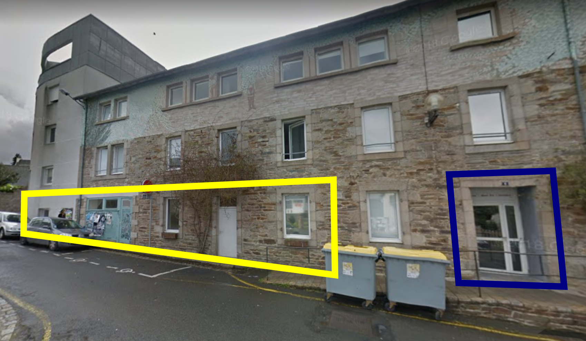

# Bilan moral

____

## Respect des statuts 1/3

- Fablab (référence MIT) : [AAAB](http://wiki.fablab.is/wiki/Fab_Lab_conformity_rating)
  - 🇦 ouverture à tous 😊
  - 🇦 charte des fablab 😊
  - 🇦(++) matériel de référence 😊
  - 🇧 participation à la communauté 😊
- Ré-appropriation technique 😊
  - diffusion de matériel
- Ouverture vers les autres fablab et communauté des makers 😊

____

## Respect des statuts 2/3

- 3R: Réduire, Réutiliser, Recycler 😊
  - Vente et recyclage de tous les PC récupérés
  - Seul une petite quantité sera désormais stockée sur site
  - Le matériel non gardé sera proposé 15j aux adhérents, puis recyclés

____

## Respect des statuts 3/3

- Promotion du logiciel et matériel Libre 😊
  - utilisation quasi-exclusive de logiciels libres
  - documentation ouverte des projets
  - diffusion du code des projets sous license libre (Clinostat, CO2...)

____

## Objectifs 2021 1/3

### Association

- Concrétisation des créneaux 😊
- Nouveaux locaux: on va en parler 😐

### Machines

- Atelier tissus:
  - cet atelier à parfaitement trouvé sa place dans nos locaux
  - Achat de la brodeuse numérique !!! 😊
- L'imprimante 3D Résine Elegoo Mars Pro2 fonctionne bien et 
  remplace dans les fais la Form2 qui est beaucoup plus cher.

____

## Objectifs 2021 2/3

### Projets

- Projet de capteur de particules:
  - Échec du partenariat avec Infothéma 🤐 (projet monté par le Fablab pour Infothéma auprès du CD22)
  - Poursuite malgré tout du projet sur fonds propres 💪
- Projet de capteur de CO2:
  - Montage du projet fin 2021
  - Premiers prototypes fin 2021
  - Atelier prévu début février 2022

____

## Objectifs 2021 2/3

### Projets

- Projet de capteur de particules:
  - Échec du partenariat avec Infothéma 🤐 (projet monté par le Fablab pour Infothéma auprès du CD22)
  - Poursuite du projet sur fonds propres 💪
- Projet de capteur de CO2 🤔:
  - Montage du projet fin 2021
  - Premiers prototypes fin 2021
  - Atelier prévu début février 2022
- Clinostat pour démo FOSM 🚀👩‍🚀:
  - Clinostat finalisé et packagé 📦
  - pas d'envoi au final 😕
____

## Objectifs 2021 3/3

## Communauté

- Compagnons numériques 😊
- Formations 😕

____

### Événements 

- Libre en Fête ~2020~ / ~2021~ / 2022 ??? 🥺
- Fête de la science 😊
- Forum des associations 😊
- Portes ouvertes 😊
- Atelier de Noël 😊

____

## Association

- Déménagement sans accrocs.
- Ouverture à 18h le Mercredi et 9h30-17h30 le Vendredi en fonction des
  possibilités
- Élargissement et diversification des profils et usages du lieu 😊
- Augmentation des interactions avec le territoire 😊
- Quelques newsletter.

____

## Compagnons numériques / Projet «remédiation»

Compagnons numériques:
- 1 session de formation débutée avec 4 jeunes, 3 ont repris après le 1er confinement.
  Ils sont allés ensuite jusqu'au bout malgré le contexte.

Projet «remédiation»:
- 1 session de 5 personnes (Cf bilan de Thierry)

____

## Investissements

- Brodeuse numérique
- Armoire anti feu
- Aspirateur
- 1 PC de modélisation supplémentaire
- 1 cuve pour air comprimé
- Matériaux pour du mobilier

____

## 2021 Une période en pointillé

Due aux restrictions du covid19 et au déménagement

- Taux d'ouverture du Fablab: 60%
- Baisse de la fréquentation liée en partie aux restrictions
  et probablement à la perte d'habitude

____

## Quelques chiffres

- 82 membres (y compris 14 pour 2021) - 98 en 2021.
- Forum : 356 membres et 5122 messages.
- Adhésion Orange:
  - Impressions, découpes et thermoformage

____

## Nos soutiens

- LTC 2021: 2 400 € pour soutien au déménagement
- CD22 2020 débloqué 2021: 2 000€ pour la brodeuse numérique
- ADIT: 2 062€ pour le projet «remédiation».

et bien entendu la **Mairie de Lannion** qui a remis à neuf
les nouveau locaux, et mets à disposition 50% de nos locaux.

____

## Déménagement 1/

Historique 2020:
- Rappel: Le Lycée souhaite réutiliser les locaux que nous occupons.
- Plusieurs pistes ont été envisagées:
  - LTC: Locaux à coté du futur parc expo
  - Plusieurs locaux privés
  - CROUS
  - La Mairie de Lannion
- De nombreuses réunions et visites !

____

## Déménagement 3/

Historique 2021:
- Février: Vote du déménagement
- Mars/Mai: Libération progressive des locaux
- Juin: Déménagement complet et nettoyage du Lycée
- Juillet/Aout: Aménagement dans les nouveaux locaux.
- Septembre: Ouverture
  
____

## Déménagement 3/

Description des nouveaux locaux

____

## Déménagement 4/

Droits et devoirs

____

# Remarques ou questions ?

# Des idées ?

____

## Déménagement 1/3

- Rappel: Le Lycée souhaite réutiliser les locaux que nous occupons.
- Plusieurs pistes ont été envisagées:
  - LTC: Locaux à coté du futur parc expo
  - Plusieurs locaux privés
  - CROUS
  - La Mairie de Lannion
- De nombreuses réunions et visites !

____

## Déménagement 2/3

- Le déménagement prévu à l'origine au 1er janvier 2021 a été repoussé à l'été 2021, graçe à la mairie, qui s'est engagée à nous reloger !
- 2 pistes sérieuses:
  - Batiment SEGPA de l'ancien Collège
    - Réaménagement temporaire avant l'éco-quartier
    - Donc pour quelques années
  
____

## Déménagement 3/3
- 2ème possibilitée:
    - Mairie + Foyer de jeunes travailleurs
        - Près de 170 m2 en plein centre
        - Aménagement à l'étude par la mairie
        - Loyer de 450€/mois auprès du FJT
        - Dossier à compléter avec la mairie.

____

____

____

____

____

