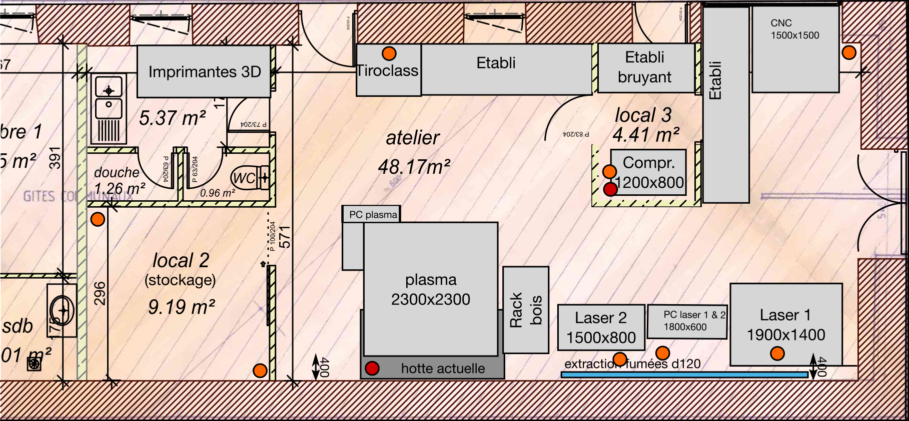
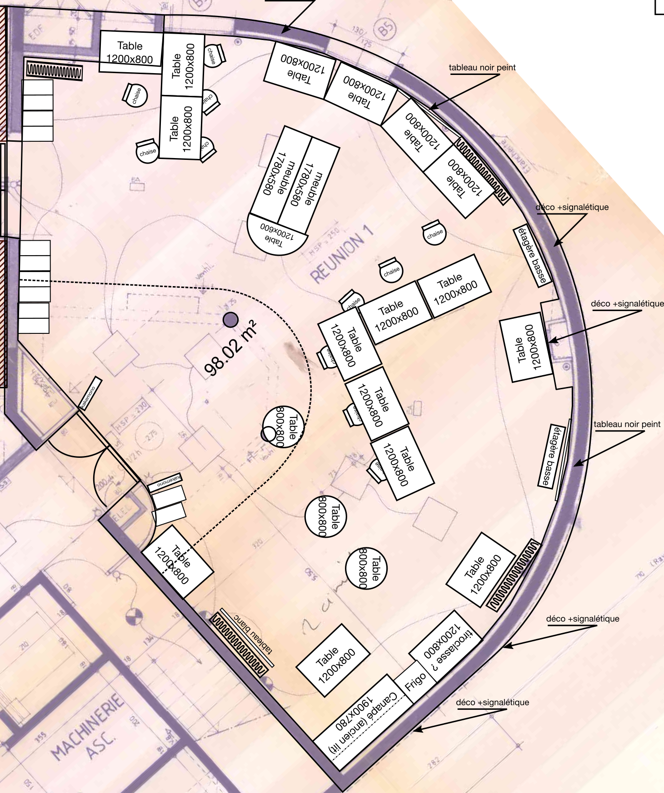

# Bilan moral

____

## Respect des statuts 1/3

- Fablab (référence MIT) : [AAAB](http://wiki.fablab.is/wiki/Fab_Lab_conformity_rating)
  - 🇦 ouverture à tous 😊
  - 🇦 charte des fablab 😊
  - 🇦(++) matériel de référence 😊
  - 🇧 participation à la communauté 😊
- Ré-appropriation technique 😊
  - diffusion de matériel
- Ouverture vers les autres fablab et communauté des makers 😊

____

## Respect des statuts 2/3

- 3R: Réduire, Réutiliser, Recycler 😊
  - Nouvelles poubelles pour le recyclage
- PC:
  - Vente et recyclage de tous les PC récupérés
  - Seul une petite quantité sera désormais stockée sur site
  - Le matériel non gardé sera proposé 15j aux adhérents, puis recyclé

____

## Respect des statuts 3/3

- Promotion du logiciel et matériel Libre 😊
  - utilisation prioritaire de logiciels libres
  - documentation ouverte des projets
  - diffusion du code des projets sous license libre (Clinostat, CO2...)

____

## Objectifs 2021 1/3

### Association

- Concrétisation des créneaux 😊
- Nouveaux locaux: on va en parler 😊

### Machines

- Atelier tissus:
  - cet atelier à parfaitement trouvé sa place dans nos locaux
  - Achat de la brodeuse numérique !!! 😊
- L'imprimante 3D Résine Elegoo Mars Pro2 fonctionne bien et
  remplace dans les faits la Form2 qui est beaucoup plus chère
  à l'usage.

____

## Objectifs 2021 2/3

### Projets

- Projet de capteur de particules:
  - Échec du partenariat avec Infothéma 🤐 (projet monté par le Fablab pour Infothéma auprès du CD22)
  - Poursuite du projet sur fonds propres 💪
- Projet de capteur de CO2 🤔:
  - Montage et premiers prototypes du projet fin 2021
  - Atelier prévu début février 2022
- Clinostat pour démo FOSM 🚀👩‍🚀:
  - Clinostat finalisé et empaqueté 📦
  - pas d'envoi au final 😕

____

## Objectifs 2021 3/3

## Communauté

- Rémédiation avec pôle emploi lancé et financé 😊
- Formations 😕

____

### Événements 

- Libre en Fête ~~2020~~ / ~~2021~~ / 2022 ??? 🥺
- Fête de la science 😊
- Forum des associations 😊
- Portes ouvertes 😊
- Atelier de Noël 😊

____

## Association

- Déménagement sans accrocs (ou presque 🦷)
- Ouverture à 18h le Mercredi et 9h30-17h30 tous les vendredi
- Élargissement et diversification des profils et usages du lieu 😊
- Augmentation des interactions avec le territoire 😊
- Quelques newsletter.

____

## Projet «remédiation» avec pôle emploi

Projet «remédiation»:

- 1 session de 5 personnes (Cf bilan de Thierry) en septembre - décembre
- 2 sessions à venir en 2022

____

## Investissements

- Brodeuse numérique
- Armoire anti feu
- Aspirateur
- 1 PC de modélisation supplémentaire
- 1 cuve pour air comprimé
- Matériaux pour du mobilier
- 1 imprimante laser

____

## 2021 Une période en pointillé

Due aux restrictions du covid19 et au déménagement

- Taux d'ouverture du Fablab: 60%
- Baisse de la fréquentation liée en partie aux restrictions
  et probablement à la perte d'habitude

____

## Quelques chiffres

- 82 membres - 98 en 2021.
- Forum : 356 membres et 5122 messages.
- Adhésion Orange:
  - Impressions, découpes et thermoformage

____

## Nos soutiens

- LTC 2021: 2 400 € pour soutien au déménagement
- CD22 2020 débloqué 2021: 2 000€ pour la brodeuse numérique
- ADIT: 2 062€ pour le projet «remédiation».

et bien entendu la **Mairie de Lannion** qui a remis à neuf
les nouveau locaux, et mets à disposition 50% de nos locaux.

____

## Déménagement 1/6

Historique 2020:

- Rappel: Le Lycée souhaite réutiliser les locaux que nous occupons.
- Plusieurs pistes ont été envisagées:
  - LTC: Locaux à coté du futur parc expo
  - Plusieurs locaux privés
  - CROUS
  - La Mairie de Lannion
- De nombreuses réunions et visites !

____

## Déménagement 2/6

Historique 2021:

- Février: Vote du déménagement
- Mars/Mai: Libération progressive des locaux
- Juin: Déménagement complet et nettoyage du Lycée
- Juillet/Août: Aménagement dans les nouveaux locaux.
- Septembre: Ouverture
  
____

## Déménagement 3/6

____
## Déménagement 4/6

____

## Déménagement 5/6

Quelques infos:

- Loyer: 450€/mois 💰
- Attention au bruit après 22h 📢
- Pas de frais supplémentaires
- Bientôt internet sans filtre ?
- Forte proximité du FJT, ENSSAT, Mediatèque, MicroFolies et du centre ville
- Il fait chaud, c'est joli 😎

On y est bien non ? 🤗
____

## Déménagement 6/6

__Merci__ au Lycée Le Dantec, au FJT, à tous les bénévoles
mais surtout, __MERCI__ à la Ville de Lannion

____

# Remarques ou questions ?

# Des idées ?
