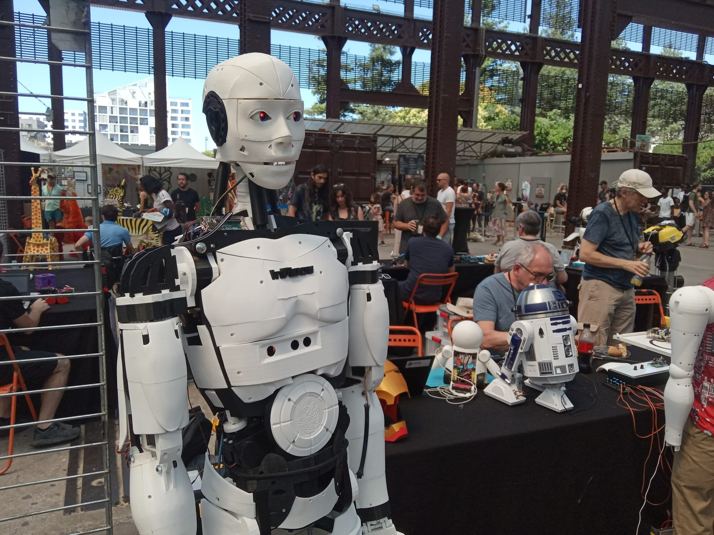

<!-- .slide: data-background="#000" class="chapter" -->

# Bilan d'activité 2022

____

## Janvier-Février-Mars

- 22.01: Participation aux MicroFolies
- 05.02: Atelier capteur CO2
- 19.03: Repair-Café
- 26.03: Libre en Fête
____

## Avril-Mai

- 07.05: Repair-Café
- 13.05: Réunion Objecterie (Repair-Café)
- 17.05: Atelier fabrication de médailles (ULIS Pontrieux)
- 20/27.05: Atelier Maker Mission Locale

____

## Juin-Juillet-Août

- 3/10/17/24: Atelier Maker Mission Locale
- 3/10/17/24: Atelier Maker Mission Locale
- 10.06: Atelier EPHAD Perros Guirec
- 13.06: Visite du Fablab de Lanvallay
- 26.06: Festival LowTech à Concarneau
- 9/10.07: MakerCampus à Nantes (Merci Maud, Matthieu et Florian !)
- 16.07: Atelier Vélo (avec Trégor Bicyclette)

____

____

## Septembre

- 14.09: Portes ouvertes étudiants
- 14.09: Rencontre avec le Centre Social St Elivet
- 26.09: Début de la formation en alternance de Florian
- 23.09: Visites du personnel de l'ENSSAT
- 24/25.09: Maker Music Festival à Rennes (Merci Manu !)

____

## Octobre

- 08/09.10: Fête de la science
- 13.10: Conférence sur la Bibliothèque des Cotes d'Armor (St Brieuc)
- 14.10: Rencontre "Construire le Numérique en Cotes d'Armor"
- 20.10: Atelier Maker (Mission Locale)
- 21.10: Rencontre CNPS (Organisme de formation)

____

## Novembre-Decembre

- 18.11: Visite de la Mairie de Lannion
- 30.11-02.12: Fablab Ephémère à Guingamp et Lannion
- 08.12: Rencontre OpenClassRoom
- 08.12: Atelier Bracelet en cuir avec le FJT
- 09.12: Animation avec le Greta
- 17.12: Atelier TShirt
- 17.12: Atelier de Noël
- Victoire AAP CD22
