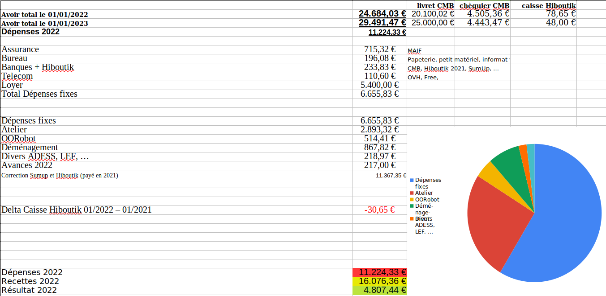
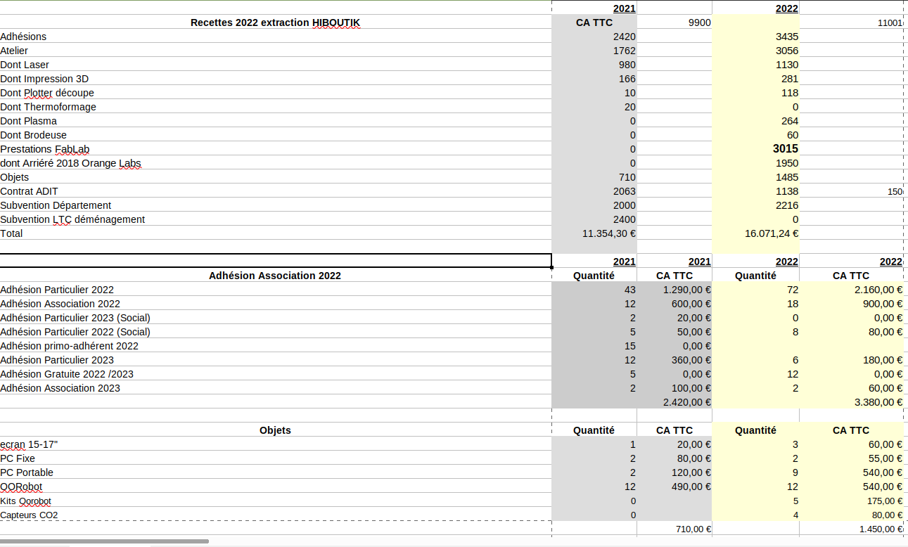
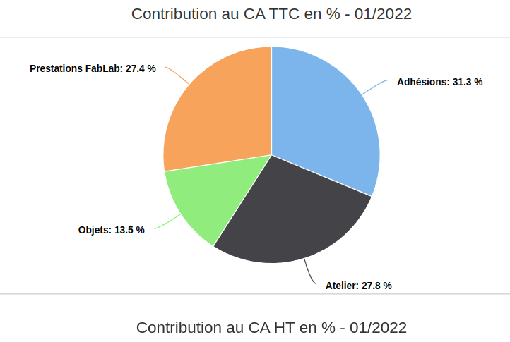
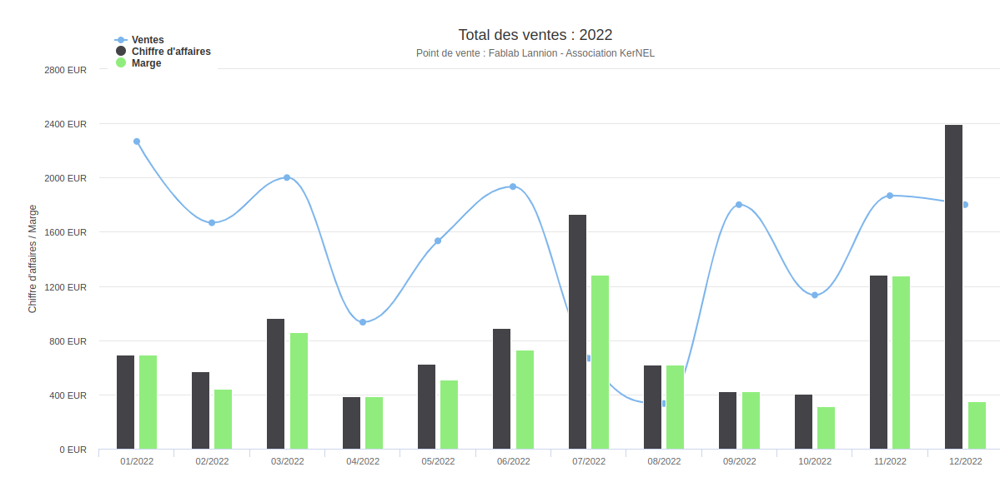
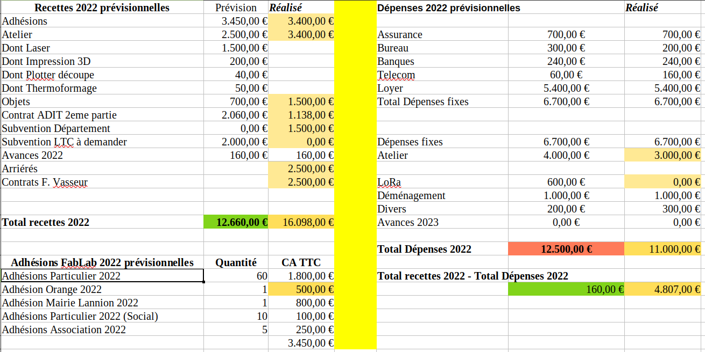
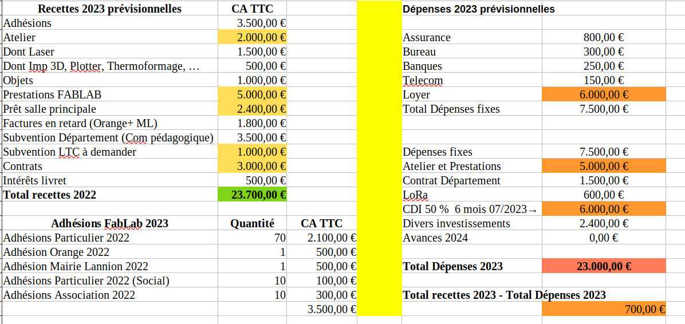

<!-- .slide: data-background="#000" class="chapter" -->

# Bilan financier

____

3eme Année Covid moins sévère : ventes “Hiboutik” en hausse, 9 000€ en 2022,
contre 4200€ en 2021, contre 5800€ en 2020.

Investissements assez faibles ~ 1 000€.

Hausse des dépenses fixes dues au paiement d’un loyer : de 1200€, on passe à
3700€ en 2021, puis à 6700€ en 2022.

CA en augmentation grâce aux contrats ADIT, à la subvention département, aux
contrats avec Orange, Mairie Lannion, FJT, et aux prestations FabLab et aux
arriérés 

**=> un résultat positif de 4.800€ pour un CA total de 16.000€.**

____

____

____

____

____

____

____

## Déclarations obligatoires

- Déplacements : RAS
- Frais de bouche : 200€
- Bilan FabLab “total” 2022 = environ 80 000€

Heures bénévolat : idem 2021, environ un ETP -> 50 000 €/an
➕ Loyer équivalent : 4.000€ (ex-cantine)
➕ Mi-temps Florian Vasseur : 10 000€

**Bilan FabLab “total”  =  CA 16 000€  + bilan “caché”**

____

## Classement du FabLab en Établissement d’Intérêt Général

il remplit maintenant
deux conditions sur trois, et la 3eme devrait être accessible compte tenu des
nombreuses prestations de formation (20% du bilan en 2021, mais > 50% en 2023).

	