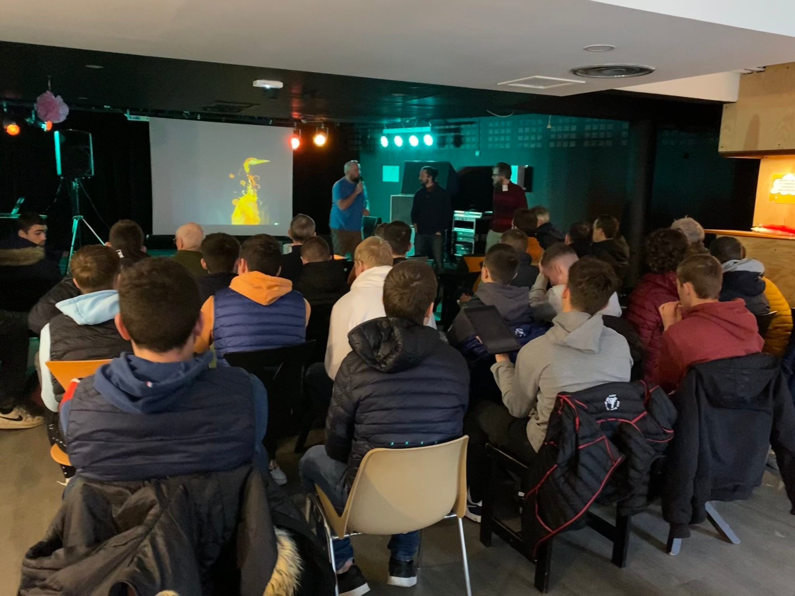

<!-- .slide: data-background="#000" class="chapter" -->

# Perspectives 2023

____

## Association

- Embauche d'un permanent
- Poursuite de l'étude du rescrit fiscal
- Amélioration de la diversité de genre

____

## Fablab à l'école

- Suite à la sélection par le CD22 et la subvention de 3 500€
- Mise en place d'ateliers gratuits dans écoles qui en feront la demande
- Mise en place d'ateliers gratuits vers les professeurs dans le Fablab

____

## Mak'Agri

____

## Réalisations pour le Fablab

- Prendre en main le nouveau scanner 3D et le documenter
- Finaliser le carter de la CNC
- Fablab Mobile

____

## Événements "Habituels"

- Libre en fête 2023
- Fête de la Science
- Forum des associations
- Portes ouvertes
- MakerFest à Nantes ?

____

## Communauté

- Liens à poursuivre:
  - FJT
  - ENSSAT
  - la Ville de Lannion
  - Anticipa
- Liens à créer
  - avec les fablab locaux
  - MakeHer

____

# Remarques ou questions ?

# Des idées ?
