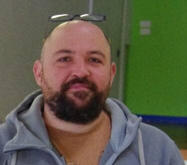

<!-- .slide: data-background="#000" class="chapter" -->

# Missions 2023
## Un permanent au Fablab

Florian Vasseur

____

## Qui suis-je?

Florian Vasseur: Alternant sur un titre professionnel de Responsable d’Espace de Médiation Numérique de Septembre 2022 à Juillet 2023

____

## 3 axes de travail

- Tisser du Lien (33%)
- Animation (33%)
- Coordination (33%)

____

## Structurés autour d’un 4ème axe…

Trouver les financements nécessaire à la création d’un poste de Fabmanager Permanent sur ½ ETP; qui pourrait servir à:

- Élargir notre accueil à de nouveaux publics, de nouveaux partenaires ?
- Ouvrir plus de créneau dans la semaine ?
- Proposer un accueil pour les professionnels ?
- Proposer de la formation ?
- Faire la com' !
- Être en soutien et en relais des bénévoles pour développer notre Fablab…
