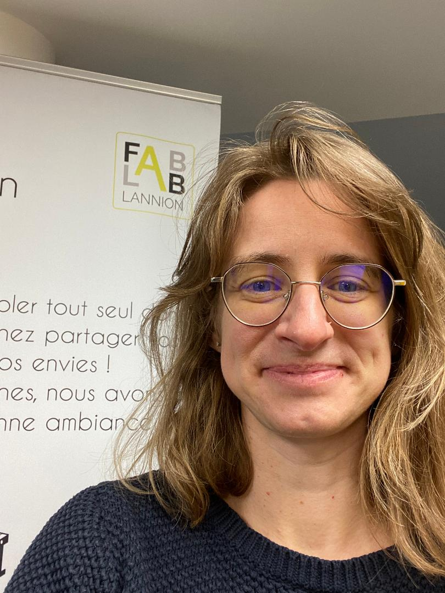

# Missions 2023
## Amélioration de la diversité de genre

Mission 2023 au FabLab de Lannion

Maïté Cartigny

____

## Qui suis-je?

- Maïté Cartigny, ingénieure logiciel
chez Orange, développeuse de
l’application mobile Orange
téléphone sur iPhone
- En « Respiration » pour 1 an: dispositif
d’Orange qui est une mise à disposition d’un
salarié à une association dans le cadre d’une
mission de type RSE

____

____

## Missions

- Améliorer la diversité de genre parmi les adhérents, dans les visites
  hebdomadaires et parmi les FabManagers
- Les étapes et critères de succès:
  - Fournir un feedback et des conseils (sondages, analyse, statut sur
    l’existant et conseils)
  - Lancer des ateliers spécifiques
  - Les nouvelles adhérentes restent
  - Des femmes deviennent FabManager et intègrent le bureau

____

## Les actions démarrées

- L’association MakeHerSpace (makeherspace.fr) va accompagner le FabLab dans
  cette mission en contrepartie de retours détaillés sur les résultats des
  actions menées.
- Une modification du site Web est en cours pour améliorer la visibilité auprès
  du nouveau public touché.
