<!-- .slide: data-background="#000" class="chapter" -->

# Bilan 2023
## Amélioration de la diversité de genre

Mission 2023 au FabLab de Lannion

Maïté Cartigny

____
## Rappel des objectifs

### Résumé de la mission
- Étude sur la féminisation des Fablabs et préconisation de mises en œuvre pour le Fablab de Lannion
- Participation et support à différents ateliers animés par des membres du Fablab 
- Animation d'ateliers dédiés en liens avec l'étude sur la féminisation des lieux

____
## Rappel des objectifs

### Résultats attendus
- Un feedback et des conseils (sondages, analyse, statut sur l’existant et conseils)
- Lancer des ateliers spécifiques
- Que les femmes restent
- Que des femmes deviennent FabManager et s’impliquent dans le bureau

____
## Partenariat avec MakeHerSpace

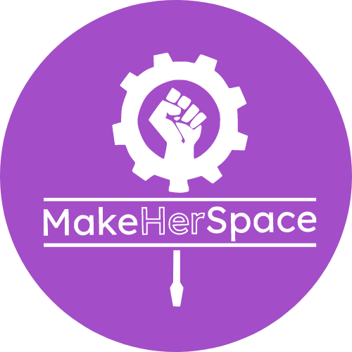

<ul>
<li>Visite de 4 FabLabs partenaires en janvier (La Verrière, Simplon Lab, WoMa, Volumes)</li>
<li>Participation à la table ronde de clôture du festival MakeHerFest</li>
<li>Mise en application de leur <a href="https://www.makeherspace.fr/manuel-pratique-inclusion-genre/">manuel de recommandations</a></li>
<li>Membre du projet MakeHerLab avec 3 autres FabLabs (La Verrière, Les Portes Logiques, La FUN), porté par MakeHerSpace et soutenu par la Fondation Orange</li>
</ul>

____
## Mise en application du manuel de recommandations

<blockquote style="width: 80%;">
En ligne et en vitrine, une présentation claire de votre lieu et des infos pratiques (horaires d’accès,programmation, tarifs), pour ne pas donner l’impression d’un club privé. 
Proposer des journées portes ouvertes, une newsletter avec possibilité de répondre et suggérer des idées.
</blockquote>

- Refonte de la page d’accueil du site internet
- Ajout des tarifs sur le site internet
- Journée portes ouvertes "Ramène ta pote" le 01/07
- Newsletter redémarrée

____
## Mise en application du manuel de recommandations

<blockquote style="width: 80%;">
Les toilettes sont adaptées aux PMR et non-genrées avec lavabo, des pictos inclusifs et équipées de protections périodiques, de produits nettoyants et de poubelles hygiéniques.
</blockquote>

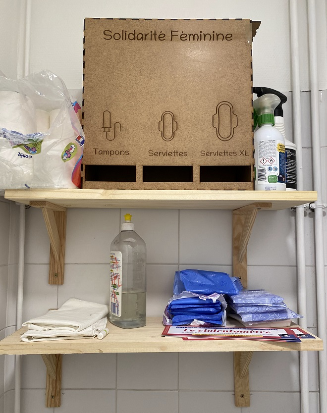
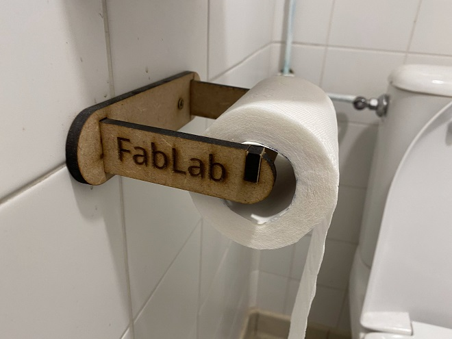
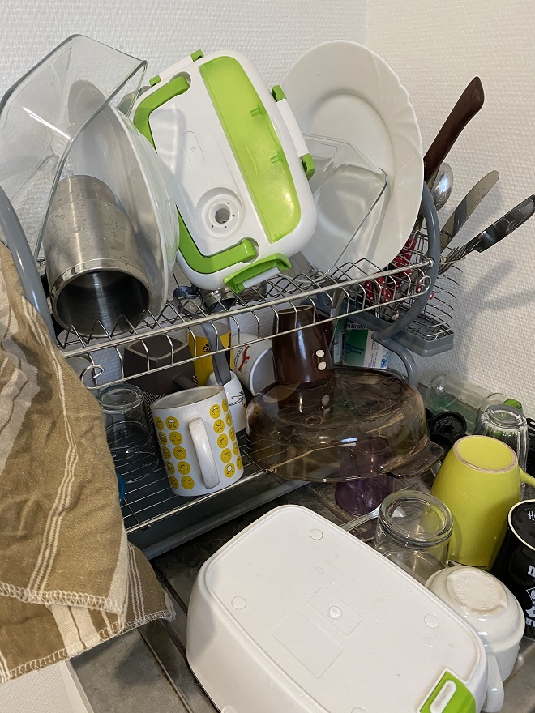
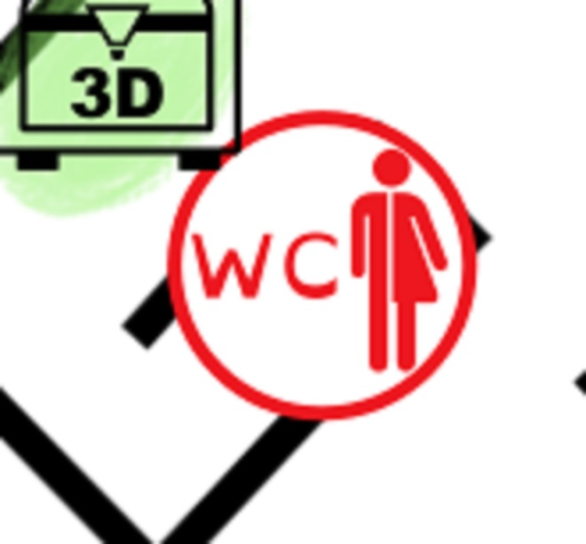

____
## Mise en application du manuel de recommandations

<blockquote style="width: 80%;">
Afficher le plan du lieu avec rangements outils/matériaux, mode de fonctionnement et spécificités de chaque endroit.
</blockquote>

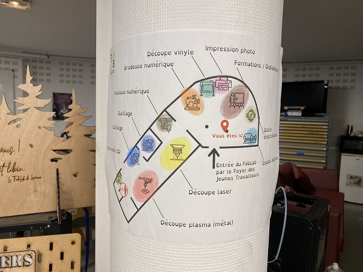

____
## Mise en application du manuel de recommandations

<blockquote style="width: 85%;">
Les personnes nouvelles doivent pouvoir s’approprier le lieu. Pour cela, il doit être propre, rangé et organisé grâce à une signalétique claire. Attention à l'aménagement global qui doit aussi convenir à des personnes plus petites ou moins valides.
</blockquote>

  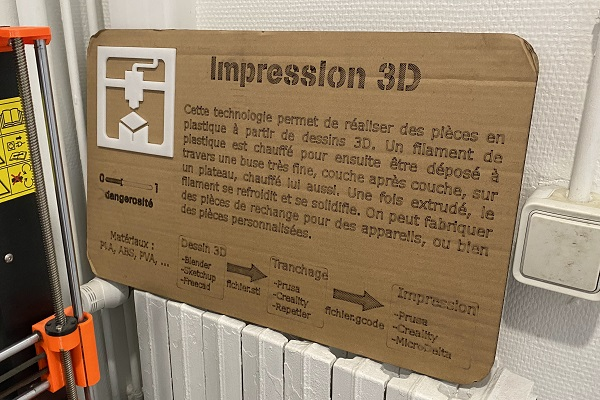
  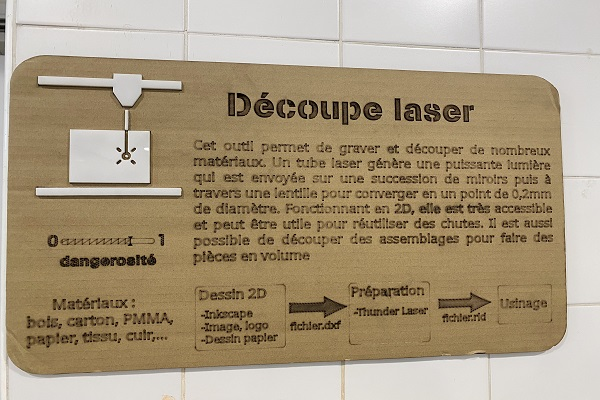
  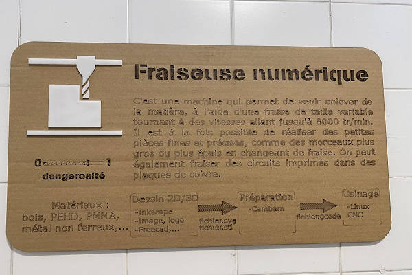
  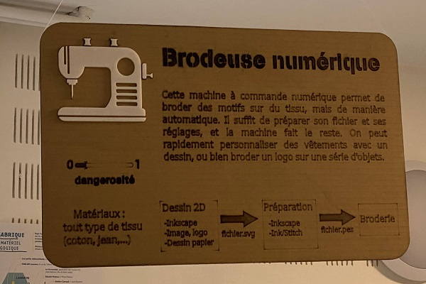
  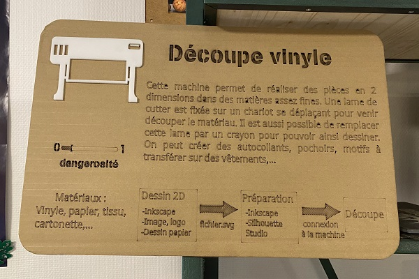
  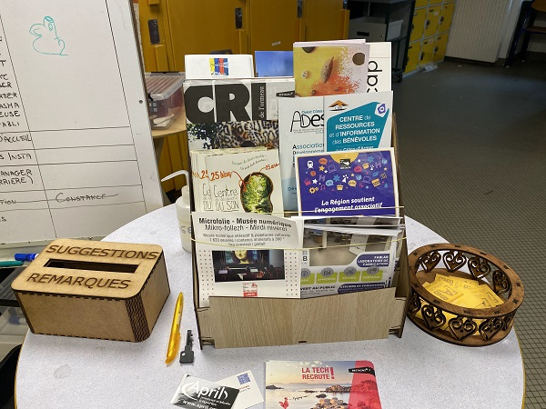
  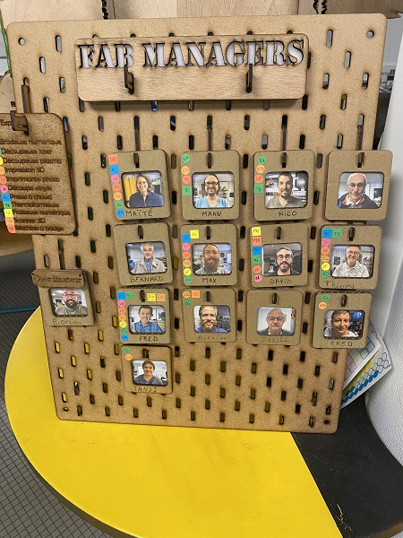

____
## Mise en application du manuel de recommandations

<blockquote style="width: 80%;">
Donner la possibilité de signaler (anonymement ou pas) tout comportement oppressif, sexiste ou une agression.
</blockquote>

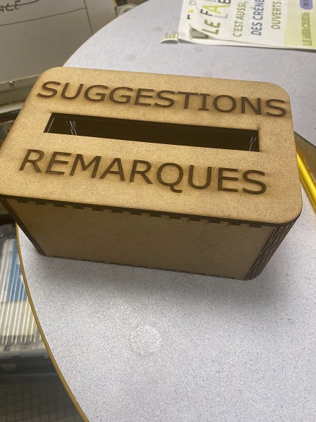

____
## Mise en application du manuel de recommandations

<blockquote style="width: 80%;">
Pourquoi pas un peu d’affichage engagé sur les murs? Drapeaux, slogans, affiches de makeuses ou de sensibilisation, etc.
</blockquote>

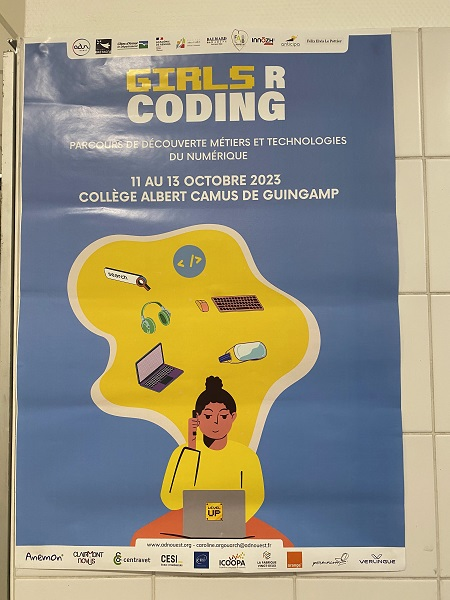
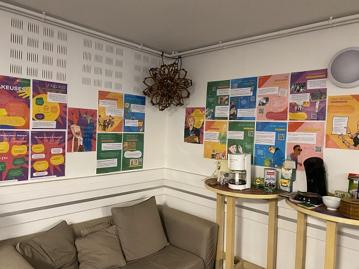
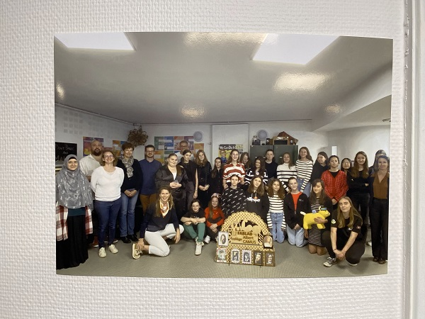

____
## Résidence du projet MakeHerLab à Lannion

- Jeu de génération d'image de "bricoleuse" avec Stable Diffusion
- Soirée Pizza papote entre adhérents et membres de MakeHerSpace
- Fresque du sexisme
- Atelier de fabrication d'anneaux de silicone à visée contraceptive

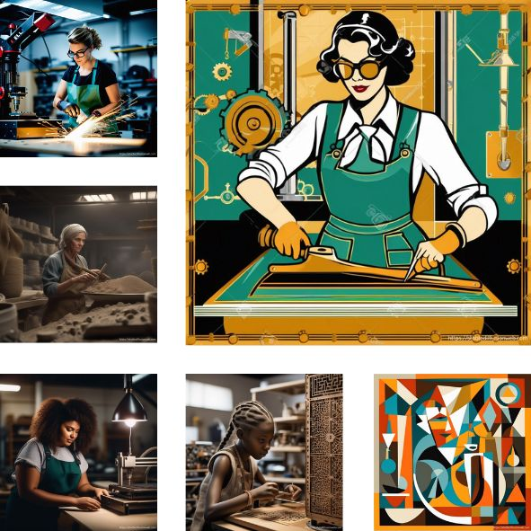
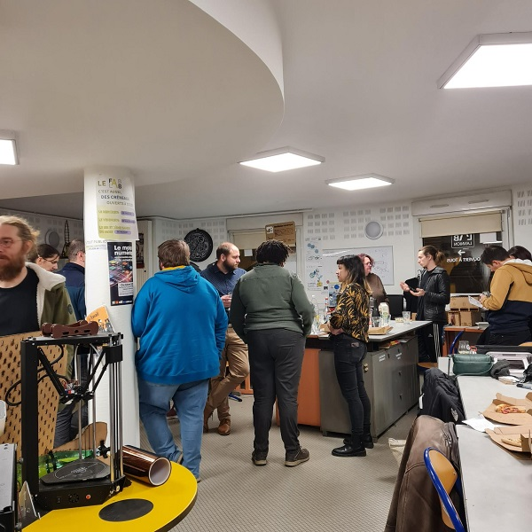
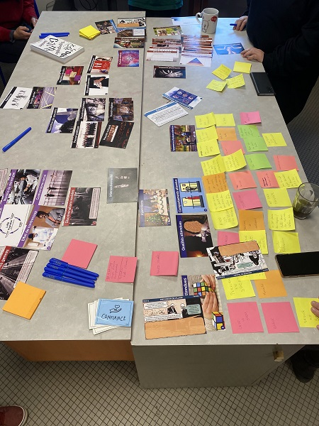
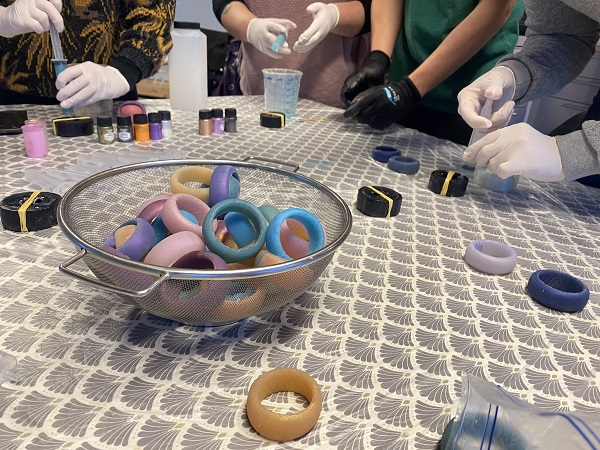

____
## Mes autres actions: Communication

- Publications sur Twitter, Facebook, Instagram, Tiktok
- Parution d'un article dans le Télégramme et dans Ouest France sur mon année au FabLab
- Partenariat avec la section MMI de l'IUT pour des recommandations sur la communication du FabLab
- Création d'un flyer
____
##  Mes autres actions: Réseau

- Prise de contact avec l'association étudiante féministe de Lannion, Les Lannionnaises
- Animation d'une conférence dans le cycle de sciences sociales des élèves de 3ème année à l'ENSSAT sur mon parcours et la Respiration au FabLab
- Création et animation d'un atelier pour le stage Girls'R Coding organisé par l'association ADN Ouest, à destination de 25 collégiennes
____
##  Mes autres actions: Animation

- Portes ouvertes Ramène ta pote
- Apéro Lab
- Création d'une formation d'initiation à la broderie
- Création d'une initiation à scratch pour adultes
- Organisation de la venue de Sam du collectif Otoko pour l'animation d'un atelier de fabrication d'anneaux en silicone à visée contraceptive (Sam a offert au FabLab un moule et un exemplaire de chacune des 10 tailles)
____
##  Bilan

- formation brodeuse : 39 personnes formées dont 31 femmes sur 6 dates
- plus de femmes adhérentes "habituées", 2 femmes Fabmanager en plus, 1 femme au bureau en 2024?
- pas de suivi de genre au moment des inscriptions, donc estimation "empirique"
____
##  Bilan en nombre de ventes

____
##  Perspectives

- Poursuite du projet MakeHerLab avec les 3 autres résidences à Tours (30/01), Quimper (20/02) et Montreuil (28/03)
- Mise en place du projet récurrent de fabrication d'une tricotteuse à chaussette (impression 3D, électronique)
- Planification d'ateliers 100% nanas (guide MakeHerSpace) 
- Ouverture d'un créneau d'open atelier 100% nanas

