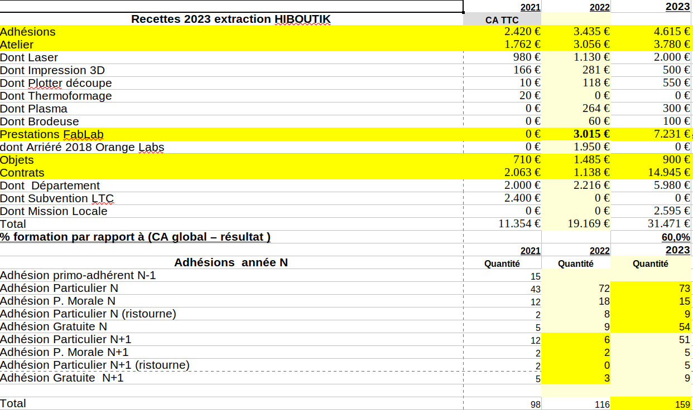
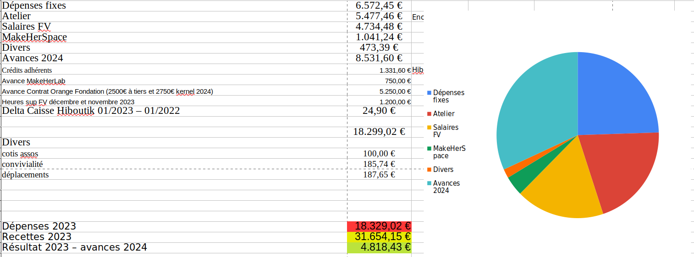
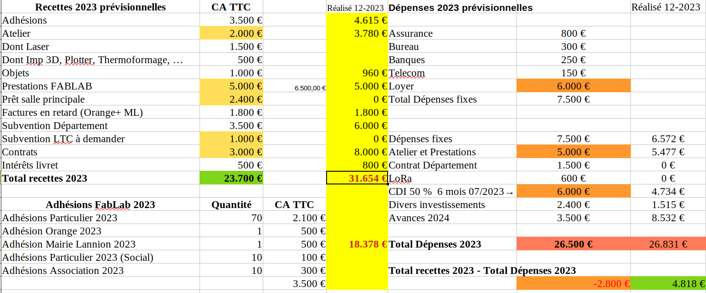

<!-- .slide: data-background="#000" class="chapter" -->

# Bilan financier

____
Avoirs FABLAB au 01/01/2023 : 42.841,50 € 

Détails : 38000€ (CE/CMB) + 4768,60€ (CC/CMB) + 72,9€ (Caisse Hiboutik)

**=> un résultat positif de 4.800€ pour un CA total de 30.000€.**

____

____

____

____

____

## Déclarations obligatoires 2023

- Déplacements : 188€
- Frais de bouche : 186€
- Bilan FabLab “total” 2023 = environ 100K€ (CA 31 000€  + bilan “caché”)

 Heures bénévolat : idem 2021, environ un ETP -> 50 000 €/an
+       Loyer équivalent :  4000€ (ex-cantine)
+       Mi-temps Florian Vasseur : 10 000€
+      Détachement Maïté Cartigny : 10 000€

____

## Classement du FabLab en Établissement d’Intérêt Général

il remplit maintenant
deux conditions sur trois, et la 3eme devrait être accessible compte tenu des
nombreuses prestations de formation (20% du bilan en 2021, mais > 60% en 2023).

Obtention du label "Education populaire" : en cours (M. Huonnic)
	
